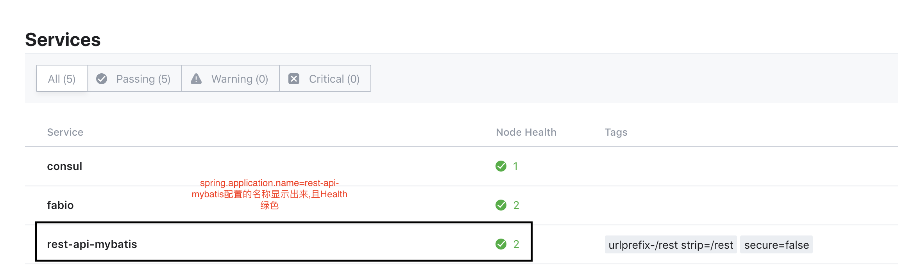

> SpringBoot: 2.1.1
> SpringCloud: Greenwich.M3
> Consul: consul:1.3.0
> Fabio: fabiolb/fabio:1.5.5-go1.9.2

**具体的pom.xml和application-dev.yml文件内容可以参考[我的GitHub项目](https://github.com/star936/rest-api-mybatis)**

### 1. Consul
#### 1.1 安装
```bash
docker pull consul:1.3.0
```
#### 1.2 启动
```bash
docker run -d -t -p 8300:8300 -p 8301:8301 -p 8302:8302 -p 8500:8500 -p 8600:8600 --name test-consul consul:1.3.0
```

### 2. Fabio
#### 2.1 安装
```bash
docker pull fabiolb/fabio:1.5.5-go1.9.2
```
#### 2.2 启动
```bash
docker run -d -t -p 9998:9998 -p 9999:9999 --link test-consul:consul -e 'registry_consul_addr=consul:8500' fabiolb/fabio:1.5.5-go1.9.2
```

### 3. Docker部署SpringBoot应用
#### 3.1 打包
**请参考[使用Docker打包SpringBoot并Push到DockerHub](/2018/12/19/spring/docker)文章中的打包.并对pom.xml和application-dev.yml、application-test.yml进行如下修改:**

*在pom.xml中添加如下内容:*
```xml
<!--<properties>标签中-->
<spring-cloud.version>Greenwich.M3</spring-cloud.version>

<!--<dependencies>标签中-->
<dependency>
    <groupId>org.springframework.cloud</groupId>
    <artifactId>spring-cloud-starter</artifactId>
</dependency>
<dependency>
    <groupId>org.springframework.boot</groupId>
    <artifactId>spring-boot-starter-actuator</artifactId>
</dependency>
<dependency>
    <groupId>org.springframework.cloud</groupId>
    <artifactId>spring-cloud-starter-consul-discovery</artifactId>
</dependency>
<dependency>
    <groupId>org.springframework.cloud</groupId>
    <artifactId>spring-cloud-starter-openfeign</artifactId>
</dependency>
<dependency>
    <groupId>com.netflix.feign</groupId>
    <artifactId>feign-httpclient</artifactId>
    <version>8.18.0</version>
</dependency>

<!--与<dependencies>标签同级-->
<dependencyManagement>
    <dependencies>
        <dependency>
            <groupId>org.springframework.cloud</groupId>
            <artifactId>spring-cloud-dependencies</artifactId>
            <version>${spring-cloud.version}</version>
            <type>pom</type>
            <scope>import</scope>
        </dependency>
    </dependencies>
</dependencyManagement>
<repositories>
    <repository>
        <id>spring-milestones</id>
        <name>Spring Milestones</name>
        <url>https://repo.spring.io/milestone</url>
        <snapshots>
            <enabled>false</enabled>
        </snapshots>
    </repository>
</repositories>
```
*在application-dev.yml中添加如下内容:*
```yaml
spring:
  application:
    name: rest-api-mybatis
  cloud:
    consul:
      host: 127.0.0.1
      port: 8500
      discovery:
        register: true
        tags: urlprefix-/rest strip=/rest
```
#### 3.2 启动
```bash
docker run --name rest_api --net=host -t star936/rest-api-mybatis:0.0.1
```
* -t参数: Docker打包应用的`镜像名:tag`

### 4. 验证
#### 4.1 查看consul ui
**访问http://localhost:8500,查看是否注册上服务,如下图所示:**


#### 4.2 请求
**向 http://localhost:9999/rest/{controller的URL} 发送请求,如果返回数据,则表示成功.**


