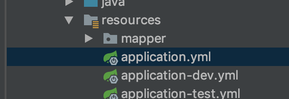
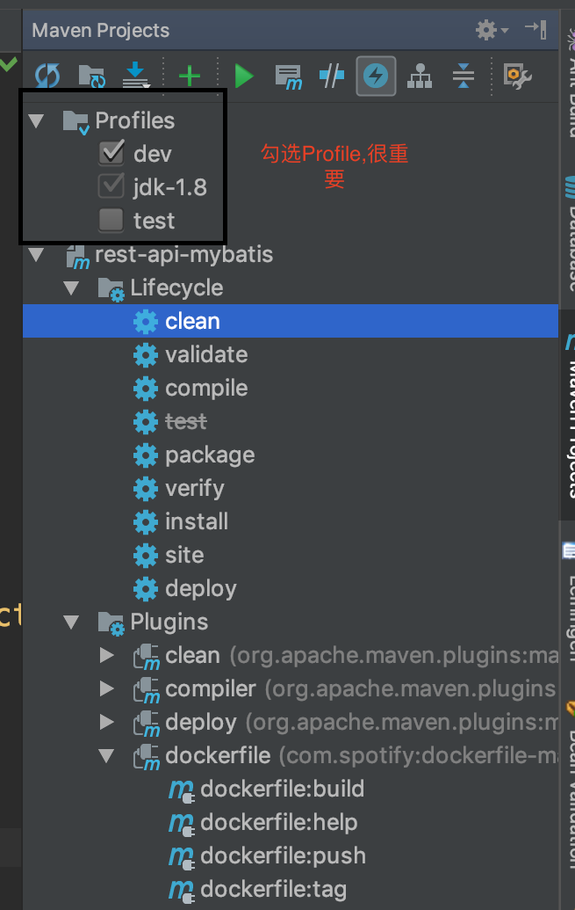

### 使用Docker打包SpringBoot并Push到DockerHub

> SpringBoot: 2.1.1
> com.spotify.dockerfile-maven-plugin: 1.4.8


#### 1. Docker打包
##### 1.1 修改application.yml
```yaml
spring:
  profiles:
    active: @spring.profiles.active@
```
** ` @spring.profiles.active@`中的`pring.profiles.active`与`pom.xml->profiles->profile->properties->spring.profiles.active`标签名称一致.**
**对于多环境的配置文件,SpringBoot提供了Profile功能来,因此在项目的`resources`目录下创建`application-{profile的名称(与pom.xml->profile->id属性值保持一致)}.yml(或.properties)`格式文件,并在打包或者运行时指定Profile即可.配置文件的名称,参考如下图所示: **

*表明只有两个profile:dev和test*

##### 1.2 Dockerfile
```Dockerfile
FROM openjdk:8-jdk-alpine3.7
VOLUME /tmp

ARG JAR_FILE
ADD target/${JAR_FILE} target/app.jar

EXPOSE 8080

RUN touch target/app.jar
ENTRYPOINT ["java","-jar","target/app.jar"]
```

##### 1.3 配置pom.xml
**添加如下内容:**
```xml
	<properties>
		<project.build.sourceEncoding>UTF-8</project.build.sourceEncoding>
		<project.reporting.outputEncoding>UTF-8</project.reporting.outputEncoding>
		<java.version>1.8</java.version>
        <dockerfile-maven-version>1.4.8</dockerfile-maven-version>
        <docker.image.prefix>star936</docker.image.prefix>
        <docker.repository.name>rest-api-mybatis</docker.repository.name>
	</properties>

    <build>
        <finalName>${docker.image.prefix}/${docker.repository.name}</finalName>
        <plugins>
            <plugin>
                <groupId>org.springframework.boot</groupId>
                <artifactId>spring-boot-maven-plugin</artifactId>
                <configuration>
                    <!--fork :  如果没有该项配置，肯定devtools不会起作用，即应用不会restart -->
                    <fork>true</fork>
                </configuration>
            </plugin>
            <plugin>
                <groupId>com.spotify</groupId>
                <artifactId>dockerfile-maven-plugin</artifactId>
                <version>${dockerfile-maven-version}</version>
                <executions>
                    <execution>
                        <id>build-image</id>
                        <phase>package</phase>
                        <goals>
                            <goal>build</goal>
                            <goal>tag</goal>
                        </goals>
                        <configuration>
                        </configuration>
                    </execution>
                    <execution>
                        <id>push-image</id>
                        <phase>deploy</phase>
                        <goals>
                            <goal>push</goal>
                        </goals>
                    </execution>
                </executions>
                <configuration>
                    <useMavenSettingsForAuth>true</useMavenSettingsForAuth>
                    <repository>${docker.image.prefix}/${docker.repository.name}</repository>
                    <tag>${project.version}</tag>
                    <buildArgs>
                        <JAR_FILE>${project.build.finalName}.jar</JAR_FILE>
                    </buildArgs>
                </configuration>
            </plugin>
        </plugins>
        <resources>
            <resource><!-- 扫描替换 -->
                <directory>src/main/resources</directory>
                <filtering>true</filtering>
            </resource>
        </resources>
    </build>
    <profiles>
        <!-- 测试环境 -->
        <profile>
            <id>test</id>
            <activation>
                <activeByDefault>true</activeByDefault>
            </activation>
            <properties>
                <spring.profiles.active>test</spring.profiles.active>
            </properties>
        </profile>
        <!-- 开发环境 -->
        <profile>
            <id>dev</id>
            <activation>
                <activeByDefault>false</activeByDefault>
            </activation>
            <properties>
                <spring.profiles.active>dev</spring.profiles.active>
            </properties>
        </profile>
    </profiles>
```

##### 1.2 打包
**参照下图:**

* 第一步: 勾选`Profile`;
* 第二步: 选中`Lifecycle->clean`并运行;
* 第三步: 选中`Lifecycle->package`并运行.

#### 2. Push镜像到DockerHub私有仓库
##### 2.1 配置Maven的setting.xml
**添加如下内容:**
```xml
<servers>
    <server>
        <id>docker.io</id>
        <username>DockerHub用户名</username>
        <password>DockerHub密码</password>
        <configuration>
        <email>DockerHub注册邮箱</email>
        </configuration>
    </server>
</servers>
```
##### 2.2 Push
**参照下图:**

**选中`Plugins->dockerfile->dockerfile:push`并运行.**
